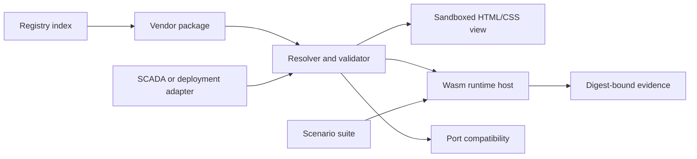

# Open Device

**Physical devices as code.**

Open Device is an experimental, vendor-neutral format and toolchain for publishing
physical and logical devices as portable web packages. A package can describe a
device's identity, ports, signals, configuration, telemetry, browser presentation,
executable behavior, test scenarios, and reproducible target artifacts.

The project brings familiar web development workflows—URLs, immutable versions,
schemas, browser rendering, package resolution, hot reload, and automated tests—to
industrial hardware without pretending that hardware is just another REST API.

> [!IMPORTANT]
> The project is documentation-first and pre-alpha. The manifest and runtime ABI are
> drafts and may change before the first tagged release.

## The idea

A vendor publishes one versioned package:

```text
device description
├── identity and capabilities
├── physical and logical ports
├── configuration and telemetry schemas
├── HTML/CSS browser views
├── executable behavior
├── target-specific artifacts
├── conformance scenarios
└── evidence bound to exact artifact digests
```

Consumers can use the same package in a catalog, documentation site, SCADA editor,
simulator, cabinet configurator, test runner, or deployment adapter.

The product direction is a registry-backed engineering workspace: roughly the role
GNS3 plays for networks, but for controllers, instruments, drives, pumps, vessels,
signals, power, and process connections. Users discover reusable equipment
definitions, create site-owned instances on a topology, connect compatible ports,
run deterministic behavior and plant models, and observe the same project through
SCADA/HMI views.

```html
<open-device
  package="https://devices.example.com/pump-controller/1.0.0/open-device.json"
></open-device>
```

```sh
device add https://devices.example.com/pump-controller/1.0.0/open-device.json
device dev
device test
device pack
device publish
```

`device check`, `device test`, and `device pack` are implemented; `add`, `dev`,
`publish`, and the custom element describe the intended developer experience and
are not implemented yet.

## Web-native by default

Open Device prefers standards that work directly on the web:

- HTTPS URLs as canonical package identifiers;
- JSON and JSON Schema for declarative models;
- HTML and CSS for vendor-authored browser presentations;
- sandboxed iframe messaging for untrusted interactive views;
- WebAssembly for deterministic logical behavior;
- `application/wasm`, standard media types, SHA-256 integrity, and HTTP caching;
- ES modules and Web Components at framework boundaries;
- vendor-hosted static packages with optional public indexes.

React, Vue, an npm registry, a specific cloud, and a specific controller are not
part of the package contract.

## Two executable models

Logical behavior may be distributed in either form:

```text
standalone module                 shared engine
-----------------                -------------------------
device-runtime.wasm              program.fbdbin
                                 + fbd-runtime.wasm
```

The second form is important for PLC and FBD ecosystems: the device package carries
program data, while a separately versioned runtime executes it. A runtime dependency
is resolved and integrity-checked exactly like any other package artifact.

## Architecture



The registry discovers immutable packages. It does not deploy controller programs,
authorize commands, or activate equipment. Those responsibilities remain with the
consumer platform and its audited adapters.

## Repository map

```text
open-device/
├── apps/
│   ├── website/          # public landing page and documentation
│   └── playground/       # inspect and connect packages in a browser
├── packages/
│   ├── spec/             # schemas, vocabulary, normative examples
│   ├── core/             # resolution, validation, integrity
│   ├── view-host/        # sandboxed HTML/CSS view protocol
│   ├── runtime/          # browser Wasm host and ABI bindings
│   ├── scenario/         # portable scenario runner and evidence
│   └── cli/              # add, dev, test, pack, publish
├── profiles/
│   └── saturn-fbd/       # first target profile: .fbdbin + shared runtime
├── examples/
│   ├── catalog/          # experimental static equipment index
│   ├── saturn-plc/       # physical controller definition
│   ├── centrifugal-pump/ # reusable rotating-equipment definition
│   └── pump-controller/  # executable control-program package
└── docs/
    └── adr/              # architectural decisions
```

See [Architecture](docs/architecture.md), [Package format](docs/package-format.md),
[Runtime ABI](docs/runtime-abi.md), and [Roadmap](docs/roadmap.md) before starting
implementation.

## Project boundaries

Open Device defines portable descriptions and tooling. Product integrations stay
outside the neutral core:

```text
Open Device                         Product adapter
-------------------------------     -------------------------------
manifest and schemas                authentication and authorization
port and signal types               live protocol drivers
HTML/CSS view protocol              telemetry storage
Wasm runtime ABI                    controller deployment
scenario and evidence formats       activation and rollback
package resolution                  product-specific editors
```

The Saturn FBD profile is the first reference target, not a privileged part of the
core. LanMon Cloud is expected to be an early consumer, not the owner of the format.

## Current plan

The first useful vertical slice is deliberately small — and implemented:

1. validate `open-device.json` — `device check`, four JSON Schemas, source/release profiles;
2. render a sandboxed browser view — `@open-device/view-host`, `apps/playground`;
3. expose typed ports and state — scalar bindings plus quality-carrying value frames;
4. execute one logical device through WebAssembly — `@open-device/runtime`, ADR-0006;
5. run the same declarative scenarios against the published artifact — `device test`;
6. produce evidence bound to package and runtime digests — `@open-device/scenario`;
7. demonstrate the flow with a pump controller package — `examples/pump-controller`,
   7/7 scenarios passing against the packaged Wasm in both Bun and the browser;
8. resolve a static equipment catalog into a topology whose scene instances keep
   canonical package identity separate from local position, wiring, and state.

Try it:

```sh
bun install
bun run --cwd examples/pump-controller build   # AssemblyScript → controller.wasm
bun packages/cli/bin/device.ts test examples/pump-controller
bun apps/playground/server.ts                  # http://localhost:8787
```

The hosted registry, signing, federation, and broad device taxonomy come after the
static catalog and package experience are proven with real consumers.
Evidence documents are currently unsigned local regression records: they identify
exactly what was executed but do not prove the run to a third party.

## Contributing

Read [CONTRIBUTING.md](CONTRIBUTING.md) and the relevant ADRs before proposing a
format change. Public documentation and identifiers are written in English.

## License

Apache License 2.0. See [LICENSE](LICENSE).
