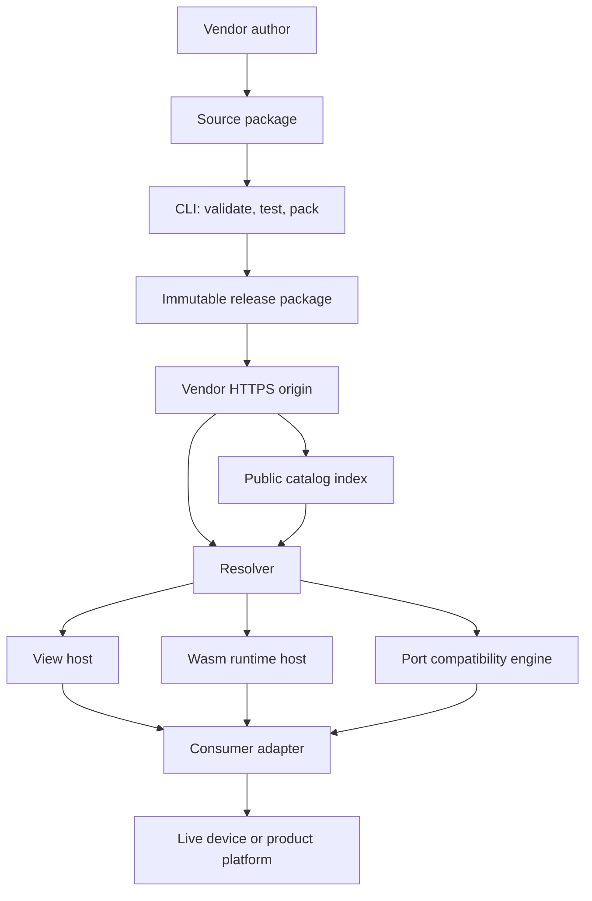
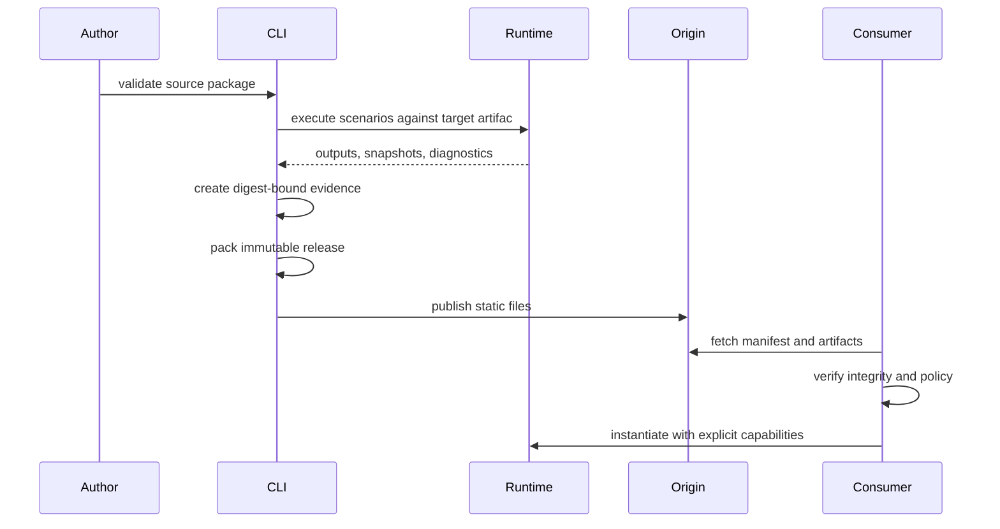

# Architecture

Status: draft architecture for v0.1.

## System contex



The catalog is a discovery service. The resolver deals in immutable package URLs and
digests. A consumer may resolve a package directly from a vendor without using the
public catalog.

## Core concepts

### Device model

A reusable description of a physical or logical product. It contains no site address,
credentials, or mutable live state.

### Source package

The vendor-owned project used during authoring. Local references and missing digests
may be allowed in development mode.

### Release package

An immutable, self-describing set of files. All executable and externally referenced
artifacts have integrity metadata. A released version must never be replaced in place.

### Artifac

A typed file referenced by the manifest: JSON model, HTML entrypoint, stylesheet,
Wasm module, target program, scenario, image, or evidence document.

### Profile

A specification layered on the neutral package format for a target ecosystem. A
profile defines media types, port mappings, runtime requirements, validation rules,
and compilation or import behavior.

### Runtime

An executable engine hosted by a consumer. A runtime may contain all behavior itself
or load target program data from another artifact.

### Instance

A consumer-owned binding of a model to a real or simulated device. It adds instance
ID, topology, connection configuration, current state, permissions, and deploymen
history.

### Adapter

Product-specific code that connects neutral package concepts to a protocol, SCADA,
cloud, controller toolchain, or deployment system.

### Scenario and evidence

A scenario is portable input/time/expectation data. Evidence is the immutable resul
of running scenarios against identified artifacts.

## Package kinds

The draft recognizes four package kinds:

| Kind | Purpose | Example |
| --- | --- | --- |
| `physical-device` | Product identity, terminals, views, optional behavior | pressure sensor |
| `logical-device` | Executable controller or virtual equipment | pump controller |
| `runtime` | Shared execution engine and ABI metadata | Saturn FBD runtime 11 |
| `plant-model` | Explicit physical/environment simulation | humidification chamber |

A single source repository may publish several packages. Composition happens through
declared dependencies and typed port connections, not by merging manifests.

## Layer boundaries

```tex
spec
  JSON vocabulary, schemas, media-type conventions

core
  fetch, resolve, validate, integrity, dependency graph

view-hos
  sandbox, state delivery, intent protocol, theme tokens

runtime
  Wasm loading, resource limits, frames, snapshot/restore

scenario
  test harness, expectations, evidence generation

profiles
  vendor/target-specific compiler, importer and mapping rules

adapters (outside or optional packages)
  protocols, deployment, SCADA, cloud, authorization
```

Dependencies point downward. `spec` has no runtime dependency. `core` does not impor
profiles. Profiles register through explicit extension points.

## End-to-end lifecycle



Deployment to real hardware is a later, adapter-owned operation and is deliberately
absent from this sequence.

## First reference flow

The first vertical slice uses a pump controller and the Saturn FBD profile:

```tex
semantic rules + signal roles
        ↓
engineering checks
        ↓
Saturn FBD compiler
        ↓
program.fbdbin + shared fbd-runtime.wasm
        ↓
portable scenarios executed against the binary
        ↓
evidence + browser presentation
```

This profile proves the `program + runtime` model while keeping `.fbdbin`, numeric pin
maps, controller HMI, and deployment outside the neutral core.

## Trust boundaries

The resolver, view host, and runtime host process untrusted vendor content. They mus
enforce the controls in [Security model](security-model.md). A valid schema is not a
trust decision, and a vendor-authored view is never implicitly authorized to control
hardware.
